# 菜之道

- ## 项目概述

#### 菜之道：智慧餐饮，美味触手可及！

**菜之道**，专为校园餐饮行业量身打造的智能解决方案，由**系统管理平台**与**顾客服务小程序**构成，旨在为餐厅与学生搭建无缝连接的桥梁。

**系统管理平台：后厨智慧大脑**

- **分类&菜品管理**：轻松掌控菜单，让每一道菜品都成为招牌。
- **订单&员工管理**：高效处理订单，优化人员配置，提升运营效率。
- **数据统计分析**：深度洞察餐厅运营，数据驱动决策，让管理更科学。
- **语音播报**：来单语音提醒，不错过任何一笔订单，后厨响应更迅速。

**顾客服务小程序：指尖上的美食捷径**

- **在线点餐**：菜品一目了然，随时随地，美味即点即享。
- **购物车管理**：随心所欲添加菜品，一键结算，省时又省心。
- **支付&催单**：安全支付，快速催单，让等待不再焦虑。
- **个性化推荐**：基于消费记录，智能推荐，让选择更简单。

**菜之道**，让餐饮管理更智能，让顾客体验更舒心，开启智慧餐饮新时代！

- ## 功能架构

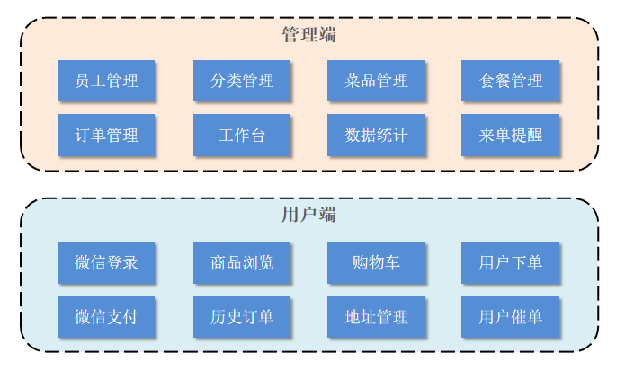

1. 管理端功能

   员工登录/退出 , 员工信息管理 , 分类管理 , 菜品管理 , 套餐管理 , 菜品口味管理 , 订单管理 ，数据统计，来单提醒。

2. 用户端功能

   微信登录 , 收件人地址管理 , 用户历史订单查询 , 菜品规格查询 , 购物车功能 , 下单 , 支付、分类及菜品浏览。

   

- ## 技术栈

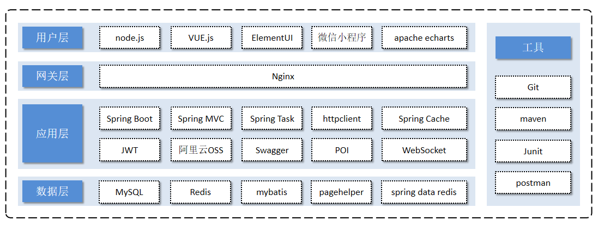

1. 用户层

   本项目中在构建系统管理后台的前端页面，我们会用到H5、Vue.js、ElementUI、apacheecharts(展示图表)等技术。而在构建移动端应用时，我们会使用到微信小程序。

2. 网关层

   Nginx是一个服务器，主要用来作为Http服务器，部署静态资源，访问性能高。在Nginx中还有两个比较重要的作用： 反向代理和负载均衡， 在进行项目部署时，要实现Tomcat的负载均衡，就可以通过Nginx来实现。

3. 应用层

   SpringBoot： 快速构建Spring项目, 采用 "约定优于配置" 的思想, 简化Spring项目的配置开发。

   SpringMVC：SpringMVC是spring框架的一个模块，springmvc和spring无需通过中间整合层进行整合，可以无缝集成。

   Spring Task: 由Spring提供的定时任务框架。

   httpclient: 主要实现了对http请求的发送。

   Spring Cache: 由Spring提供的数据缓存框架。

   JWT: 用于对应用程序上的用户进行身份验证的标记。

   阿里云OSS: 对象存储服务，在项目中主要存储文件，如图片等。

   Swagger： 可以自动的帮助开发人员生成接口文档，并对接口进行测试。

   POI: 封装了对Excel表格的常用操作。

   WebSocket: 一种通信网络协议，使客户端和服务器之间的数据交换更加简单，用于项目的来单、催单功能实现。

4. 数据层

   MySQL： 关系型数据库, 本项目的核心业务数据都会采用MySQL进行存储。

   Redis： 基于key-value格式存储的内存数据库, 访问速度快, 经常使用它做缓存。

   Mybatis： 本项目持久层将会使用Mybatis开发。

   pagehelper: 分页插件。

   spring data redis: 简化java代码操作Redis的API。

5. 工具

   git: 版本控制工具, 在团队协作中, 使用该工具对项目中的代码进行管理。

   maven: 项目构建工具。

   junit：单元测试工具，开发人员功能实现完毕后，需要通过junit对功能进行单元测试。

   postman: 接口测试工具，模拟用户发起的各类HTTP请求，获取对应的响应结果。

- ## 效果展示

1. 管理端登录页面；

   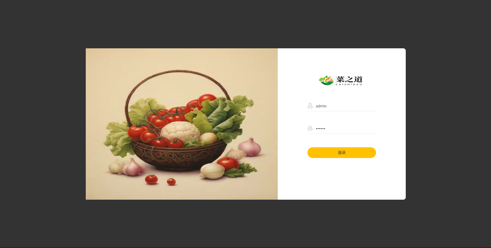

2. 管理端工作台页面；

   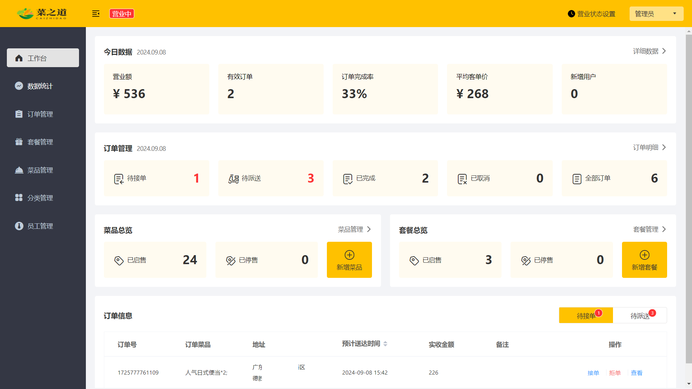

3. 管理端订单统计页面；

   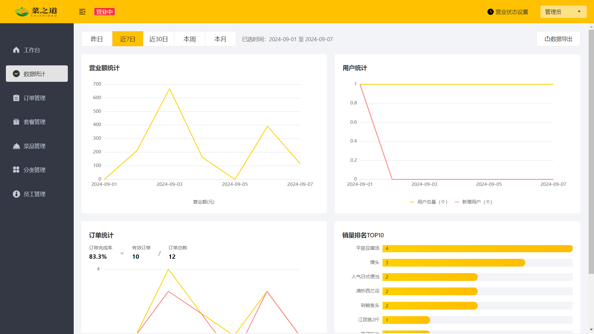

4. 管理段订单管理页面；

   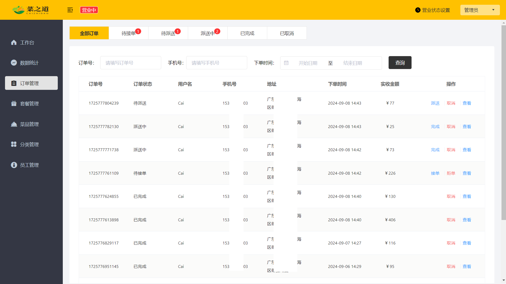

5. 管理端套餐管理页面；

   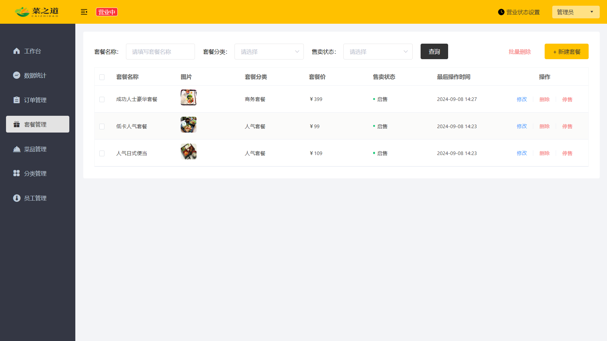

6. 管理端菜品管理页面；

   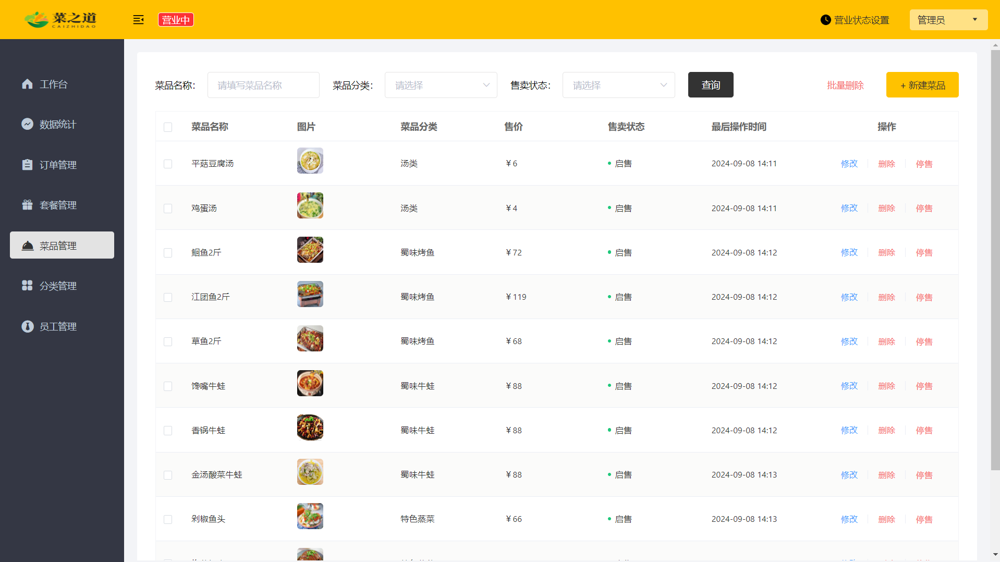

7. 管理端分类管理页面；

   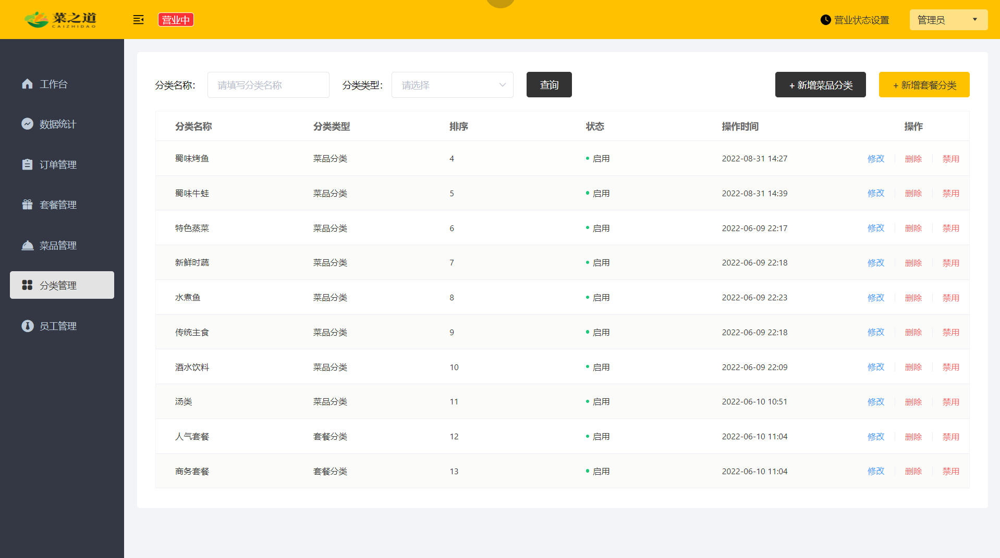

8. 用户端菜品页面；

   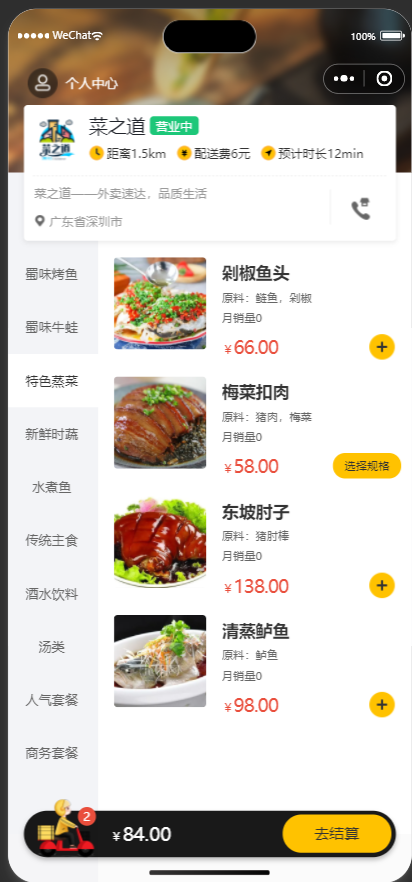

9. 用户端下单页面；

   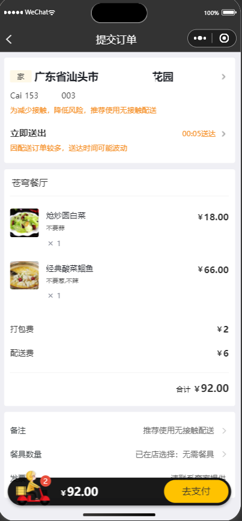
